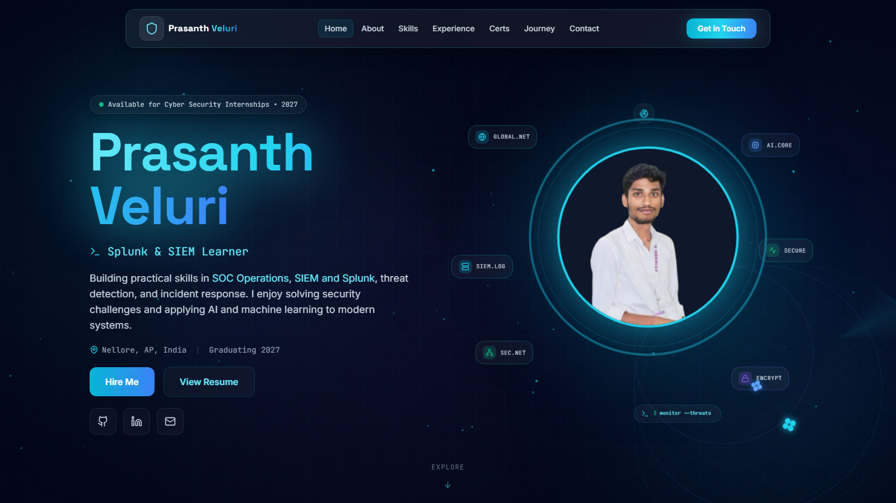

# Veluri Prasanth — Cyber Security Portfolio

[](https://veluri-prasanth.vercel.app)
[](https://github.com/Prashu2603)
[](https://linkedin.com/in/prasanth-veluri)



## Live portfolio

**[veluri-prasanth.vercel.app](https://veluri-prasanth.vercel.app)**

## About

This is my personal cyber security portfolio. It presents my education, technical skills, internships, leadership experience, certifications, planned security projects, resume, and contact information.

I am a final-year B.Tech Information Technology student focused on SOC operations, SIEM, Splunk, threat detection, incident response, cloud security, and AI/ML.

## Highlights

- Responsive cyber-security themed interface
- Animated full-screen hero and custom cyber illustration
- Education, experience, skills, and leadership sections
- Verified certificate links, including Microsoft Applied Skills
- Downloadable current resume
- Contact form that sends enquiries directly to email
- Keyboard focus styles and reduced-motion support
- Open Graph and Twitter social preview metadata
- Automated Vercel deployments from GitHub

## Certifications

- Microsoft Applied Skills — Get Started with Cloud Security and Monitoring Tasks
- Cisco — Introduction to Cybersecurity
- NPTEL — Privacy and Security on Online Social Media
- Supraja Technologies — Cyber Security Internship Certification
- IEEE Student Member and Finance Lead

Microsoft credential: [Verify online](https://learn.microsoft.com/api/credentials/share/en-us/PrasanthVeluri-3985/EBAE56196FDBAC58?sharingId=DFA2194549EFC179)

## Technology stack

- React 18
- TypeScript 5
- Vite 5
- Tailwind CSS 3
- Framer Motion
- Lucide React
- FormSubmit AJAX
- Vercel

## Run locally

Requirements: Node.js 18 or newer and npm.

```bash
git clone https://github.com/Prashu2603/portfolio.git
cd portfolio
npm install
npm run dev
```

Open the local URL displayed by Vite.

## Production build

```bash
npm run build
npm run preview
```

The optimized build is generated in `dist/`.

## Project structure

```text
portfolio/
├── public/
│   ├── certificates/
│   ├── resume/
│   ├── Pic.png
│   ├── favicon.svg
│   └── portfolio-preview.png
├── src/
│   ├── components/
│   ├── hooks/
│   ├── App.tsx
│   ├── index.css
│   └── main.tsx
├── index.html
├── package.json
├── tailwind.config.js
└── vite.config.ts
```

## Contact form activation

The contact form uses FormSubmit to deliver messages directly to `prasanthveluri03@gmail.com`. On the first live submission, FormSubmit sends an activation email. The form owner must open that email and confirm the endpoint once; later messages are delivered automatically.

## Contact

- Email: [prasanthveluri03@gmail.com](mailto:prasanthveluri03@gmail.com)
- LinkedIn: [linkedin.com/in/prasanth-veluri](https://linkedin.com/in/prasanth-veluri)
- GitHub: [github.com/Prashu2603](https://github.com/Prashu2603)
- Location: Nellore, Andhra Pradesh, India

## License

This repository contains personal portfolio content and assets. Please do not reuse personal information, photographs, resume, or certificates without permission.

© 2026 Veluri Prasanth
